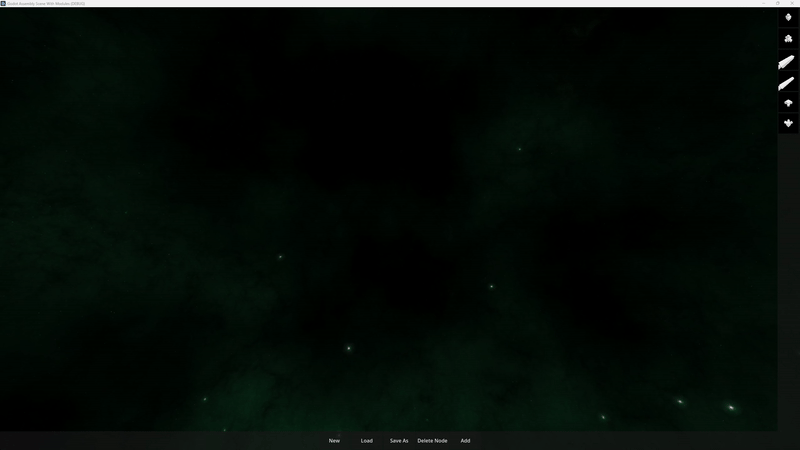

## Brief:

Simple object assembly system for games.

Work in progress.

	
## References:
* https://github.com/remorse107/vertexsnap/blob/master/addons/vertexsnap/plugin.gd
* https://forums.unrealengine.com/t/rotation-from-normal/11543/3
* https://www.youtube.com/watch?v=NtVABru6OXE
* https://github.com/petrocket/spacescape
* https://danilw.github.io/GLSL-howto/cubemap_to_panorama_js/cubemap_to_panorama.html
* https://docs.godotengine.org/en/stable/index.html
* https://github.com/robb83/godot-plugin-snap-to-surface